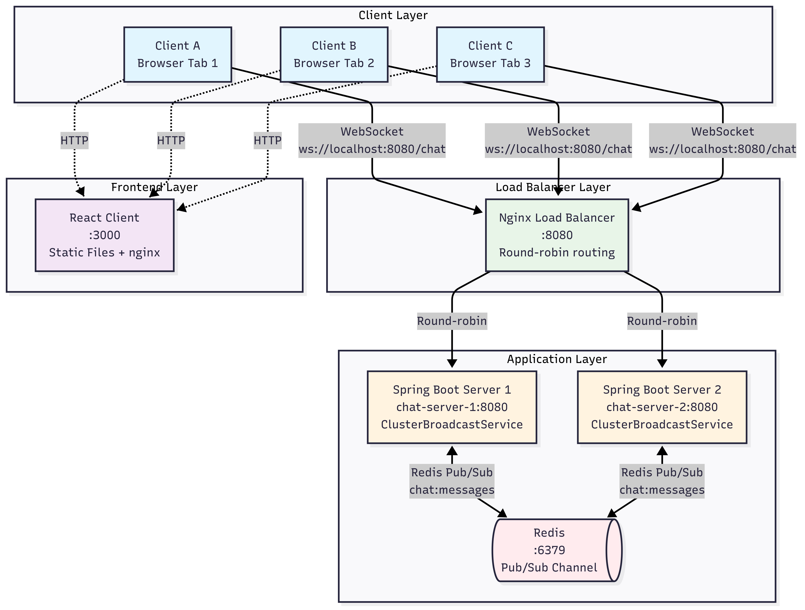

# Chat Application

A real-time chat application built with Spring Boot and React to explore WebSocket communication and load balancing with clustered deployments.

## Overview

This project explores load balancing WebSocket communication using:

-   **Backend**: Spring Boot 3.5.3 with Spring WebSocket and Redis clustering
-   **Frontend**: React with Vite and WebSocket client
-   **Load Balancing**: Nginx with WebSocket support
-   **Clustering**: Redis pub/sub for inter-server communication

## Prerequisites

-   **Java 21+**
-   **Node.js 18+** and npm
-   **Docker** and Docker Compose (for clustering)
-   **Redis** (for cluster mode)

## Development Setup

### Running the Server (Single Instance)

```bash
cd server
./gradlew bootRun
```

The server will start on `http://localhost:8080` with WebSocket endpoint at `ws://localhost:8080/chat`

### Running the Client (Development)

```bash
cd client
npm install
npm run dev
```

The client will start on `http://localhost:5173` (Vite dev server)

### Building for Production

**Server:**

```bash
cd server
./gradlew build
```

**Client:**

```bash
cd client
npm run build
```

## How Clustering Works

### Architecture

The application supports two modes:

1. **Local Mode** (default): Single server instance using `LocalBroadcastService`
2. **Cluster Mode**: Multiple server instances synchronized via Redis using `ClusterBroadcastService`

### Cluster Communication



## Running the Cluster with Docker Compose

### Full Cluster Setup

```bash
# Build and start all services
docker-compose up --build

# Run in background
docker-compose up --build -d

# View logs
docker-compose logs -f

# Stop all services
docker-compose down
```

### Services

The Docker Compose setup includes:

1. **Redis** (`localhost:6379`): Message broker for clustering
2. **chat-server-1** and **chat-server-2**: Two Spring Boot instances in cluster mode
3. **nginx** (`localhost:8080`): Load balancer for backend services
4. **client** (`localhost:3000`): React frontend with nginx

### Service URLs

-   **React Client**: http://localhost:3000
-   **Backend Load Balancer**: http://localhost:8080
-   **WebSocket Endpoint**: ws://localhost:8080/chat
-   **Health Check**: http://localhost:8080/actuator/health

### Testing the Cluster

1. Open multiple browser tabs to http://localhost:3000
2. Connect with different usernames
3. Send messages and observe real-time synchronization
4. Monitor logs to see load balancing in action:

```bash
# Watch nginx routing decisions
docker-compose logs -f nginx

# Watch Redis pub/sub messages
docker-compose logs -f chat-server-1 chat-server-2
```

## Configuration

### Environment Variables

**Server (application.properties):**

```properties
# Enable cluster mode
spring.profiles.active=cluster

# Redis configuration
spring.data.redis.host=localhost
spring.data.redis.port=6379
```

**Client (.env):**

```properties
# WebSocket endpoint
VITE_WEBSOCKET_URL=ws://localhost:8080/chat
```

## Technology Stack

### Backend

-   Spring Boot 3.5.3 with Spring WebSocket
-   Spring Data Redis for clustering
-   Spring Boot Actuator for monitoring
-   Jackson for JSON serialization
-   Java 21 and Gradle

### Frontend

-   React 19 with Vite
-   Bootstrap 5 for styling
-   WebSocket API for real-time communication

### Infrastructure

-   Nginx for load balancing and static file serving
-   Redis for pub/sub messaging
-   Docker multi-stage builds
-   Docker Compose for orchestration
